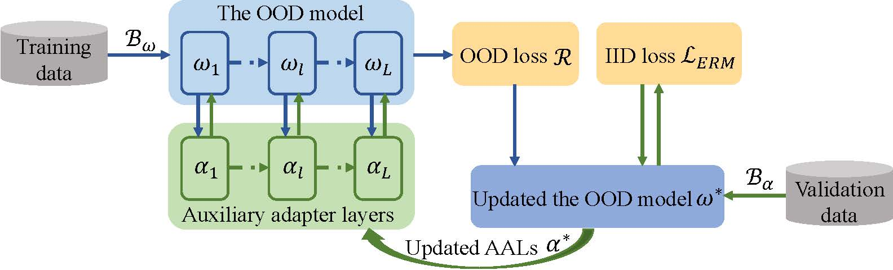
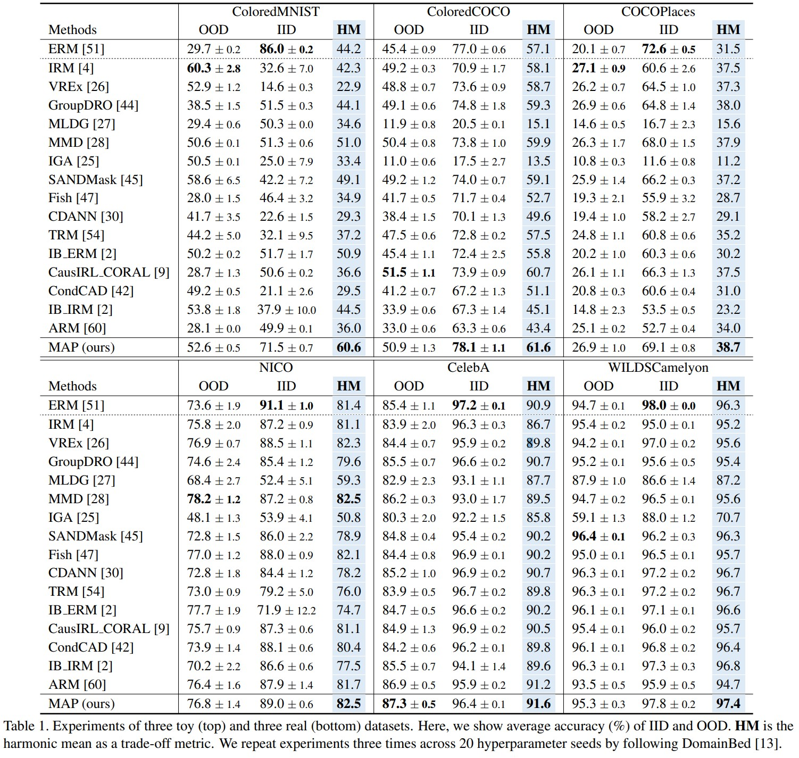

# Model-Agnostic Adapters [ICCV 2023 Oral]

Official implementation of the paper "[MAP: Towards Balanced Generalization of IID and OOD through Model-Agnostic Adapters](https://openaccess.thecvf.com/content/ICCV2023/papers/Zhang_MAP_Towards_Balanced_Generalization_of_IID_and_OOD_through_Model-Agnostic_ICCV_2023_paper.pdf)".

**************

## Highlights



> **Abstract:** Deep learning has achieved tremendous success in recent years, but most of these successes are built on an independent and identically distributed (IID) assumption. This somewhat hinders the application of deep learning to the more challenging out-of-distribution (OOD) scenarios. Although many OOD methods have been proposed to address this problem and have obtained good performance on testing data that is of major shifts with training distributions, interestingly, we experimentally find that these methods achieve excellent OOD performance by making a great sacrifice of the IID performance. We call this finding the IID-OOD dilemma. Clearly, in real-world applications, distribution shifts between training and testing data are often uncertain, where shifts could be minor, and even close to the IID scenario, and thus it is truly important to design a deep model with the balanced generalization ability between IID and OOD. To this end, in this paper, we investigate an intriguing problem of balancing IID and OOD generalizations and propose a novel **M**odel **A**gnostic ada**P**ters (MAP) method, which is more reliable and effective for distribution-shift-agnostic real-world data. Our key technical contribution is to use auxiliary adapter layers to incorporate the inductive bias of IID into OOD methods. To achieve this goal, we apply a bilevel optimization to explicitly model and optimize the coupling relationship between the OOD model and auxiliary adapter layers.     We also theoretically give a first-order approximation to save computational time.  Experimental results on six datasets successfully demonstrate that MAP can greatly improve the performance of IID while achieving good OOD performance.

## Supported Methods

The [currently available algorithms](MAP/DomainBed/domainbed/learning/algorithms.py) are:

- Empirical Risk Minimization (ERM, [Vapnik, 1998](https://www.wiley.com/en-fr/Statistical+Learning+Theory-p-9780471030034)).
- Invariant Risk Minimization (IRM, [Arjovsky et al., 2019](https://arxiv.org/abs/1907.02893)).
- Variance Risk Extrapolation (VREx, [Krueger et al., 2020](https://arxiv.org/abs/2003.00688)), contributed by [@zdhNarsil](https://github.com/zdhNarsil).
- Adaptive Risk Minimization (ARM, [Zhang et al., 2020](https://arxiv.org/abs/2007.02931)), contributed by [@zhangmarvin](https://github.com/zhangmarvin).
- Group Distributionally Robust Optimization (GroupDRO, [Sagawa et al., 2020](https://arxiv.org/abs/1911.08731)).
- Meta Learning Domain Generalization (MLDG, [Li et al., 2017](https://arxiv.org/abs/1710.03463)).
- Maximum Mean Discrepancy (MMD, [Li et al., 2018](https://openaccess.thecvf.com/content_cvpr_2018/papers/Li_Domain_Generalization_With_CVPR_2018_paper.pdf)).
- Out-of-Distribution Generalization with Maximal Invariant Predictor (IGA, [Koyama et al., 2020](https://arxiv.org/abs/2008.01883)).
- Smoothed-AND mask (SAND-mask, [Shahtalebi et al., 2021](https://arxiv.org/abs/2106.02266)).
- Gradient Matching for Domain Generalization (Fish, [Shi et al., 2021](https://arxiv.org/pdf/2104.09937.pdf)).
- Conditional Domain Adversarial Neural Network (CDANN, [Li et al., 2018](https://openaccess.thecvf.com/content_ECCV_2018/papers/Ya_Li_Deep_Domain_Generalization_ECCV_2018_paper.pdf)).
- Learning Representations that Support Robust Transfer of Predictors (TRM, [Xu et al., 2021](https://arxiv.org/abs/2110.09940)).
- Invariance Principle Meets Information Bottleneck for Out-of-Distribution Generalization (IB-ERM , [Ahuja et al., 2021](https://arxiv.org/abs/2106.06607)).
- Invariance Principle Meets Information Bottleneck for Out-of-Distribution Generalization (IB-IRM, [Ahuja et al., 2021](https://arxiv.org/abs/2106.06607)).
- Optimal Representations for Covariate Shift (CAD & CondCAD, [Ruan et al., 2022](https://arxiv.org/abs/2201.00057)), contributed by [@ryoungj](https://github.com/ryoungj).
- Causality based invariant representation learning algorithm using the CORAL distance from (https://arxiv.org/abs/2206.11646) [CausIRL_CORAL].

## Results

**MAP in comparison with 16 existing methods on 6 OOD benchmarks** 



## Environment requirements
- Python 3.6 or above
- The packages listed in `requirements.txt`. You can install them via `pip install -r requirements.txt`. Package `torch_scatter` may require a [manual installation](https://github.com/rusty1s/pytorch_scatter#installation)
- Submodules are added to the path:
```sh
export PYTHONPATH="$PYTHONPATH:$(pwd)/external/DomainBed/"
export PYTHONPATH="$PYTHONPATH:$(pwd)/external/wilds/"
```

## Data preparation
Please follow [this instruction](DATA.md) for three toy datasets and three real datasets. Dataset list:

- [ColoredMNIST](#coloredmnist)
- [ColoredCOCO](#coloredcoco)
- [COCOPlaces](#cocoplaces)
- [NICO](nico)
- [CelebA](celeba)
- [WILDSCamelyon](#wildscamelyon)

## Training and Evaluation

Run the following command to train and evaluate MAP or please refer to [README.md](MAP/DomainBed/sweep/README.md) for more details.

**Train a model**
```
python -m domainbed.train\
        --data_dir=./datasets/MNIST/\
        --algorithm=IRM_MAP\
        --dataset=ColoredMNIST\
        --test_env=2
```

**Launch a sweep:**
```
python -m domainbed.sweep launch\
        --data_dir=./datasets/MNIST/\
        --algorithm=IRM_MAP\
        --output_dir=./results/\
        --command_launcher=local
```

To view the results of your sweep:
```
python -m domainbed.scripts.collect_results\
        --input_dir=./results/\
```


## Citation
If you find the code useful or find our paper relevant to your research, please consider citing:
```
@inproceedings{zhang2023map,
  title={MAP: Towards Balanced Generalization of IID and OOD through Model-Agnostic Adapters},
  author={Zhang, Min and Yuan, Junkun and He, Yue and Li, Wenbin and Chen, Zhengyu and Kuang, Kun},
  booktitle={Proceedings of the IEEE/CVF International Conference on Computer Vision, {ICCV}},
  pages={11921--11931},
  year={2023}
}
```

## Contact
If you have any questions, please create an issue on this repository or contact at <zhangmin.milab@zju.edu.cn>. 


## Acknowledgement

Our code is based on [Domainbed](https://github.com/facebookresearch/DomainBed) and [OoD-Bench](https://github.com/m-Just/OoD-Bench/tree/main) repository. We thank the authors for releasing their code. If you use our model and code, please consider citing these works as well.


